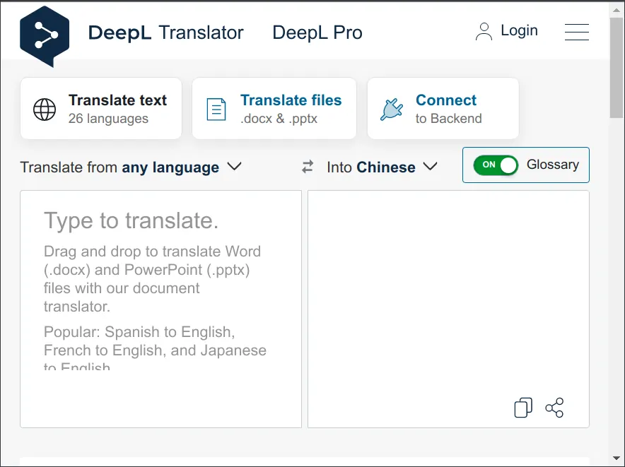

# deepl client filesystem

a browser extension to
connect the deepl.com translator to your file system

status: abandoned

## install

```
git clone https://github.com/milahu/deepl-client-filesystem.git
cd deepl-client-filesystem
( cd backend; npm install; )
( cd extension; npm install; )
```

## run

```
cd deepl-client-filesystem
( cd backend; npm run start &; )
( cd extension; npm run dev; )
```

* chrome -> menu -> extensions
* enable dev mode
* load unpacked extension from `deepl-client-filesystem/extension/build/`
* configure the extension
  * open the extension popup
  * set the backend URL, for example `http://127.0.0.1:9218`
  * save config
* open https://www.deepl.com/translator
* you should see a new button `Connect to Backend`



* create a test input file
  * `mkdir -p ~/.cache/deepl-client-filesystem/en/de`
  * `echo hello world > ~/.cache/deepl-client-filesystem/en/de/just-a-test.txt`
* in the deepl translator, click the button `Connect to Backend`
* now the content of `~/.cache/deepl-client-filesystem/en/de/just-a-test.txt` should be copied to the translator

## todo

* get the translated `targetText` from the translator, send it to the backend, write to file
* the `targetFile` path could be `~/.cache/deepl-client-filesystem/en/de/result/just-a-test.txt`
* allow the user to fix the translation in the deepl interface, save the new translation to file
* allow to navigate the input files: load first, go to next, go to previous, select file
